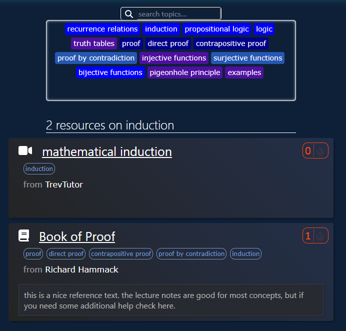

  

  
# link

check out the web app here 👉[msup.vercel.app](https://msup.vercel.app)

# about
msup was created to connect MCIT students with the most relevant and  peer approved supplemental resources on challenging topics.

# technologies used
- frontend: React (JavaScript)
- backend: Supabase (PostgreSQL)
- user authentication: OAuth
- deployed with Vercel

# features 
## realtime class search

  

## filter by topic

  

